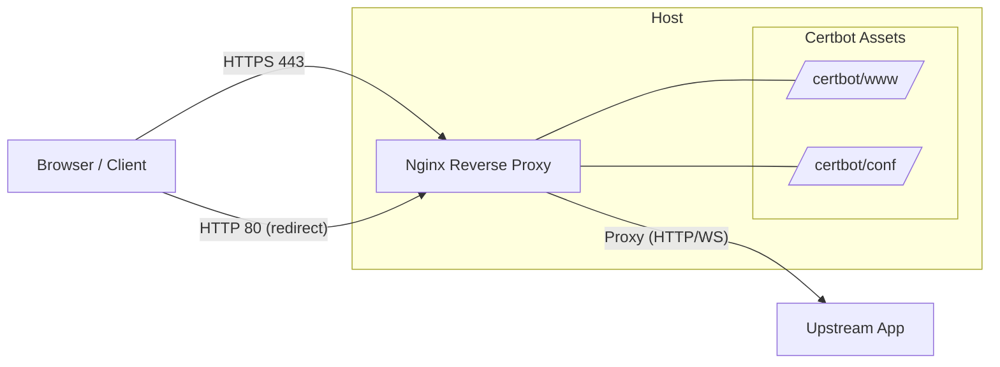
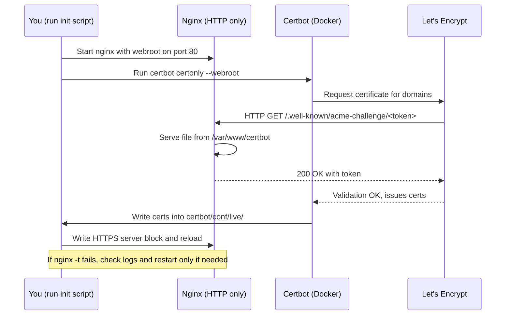
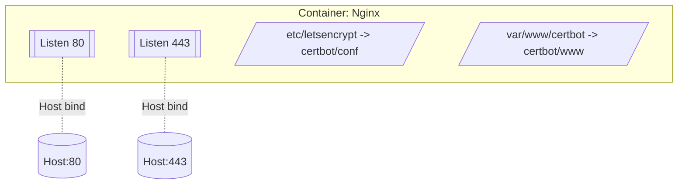

# Nginx Reverse Proxy with Auto SSL

A simple toolkit for setting up Nginx reverse proxy with automatic SSL certificate management.

## Quick Start Guide

1. Edit `init-letsencrypt.sh` to configure your settings:
   ```bash
   # Edit these settings in init-letsencrypt.sh
   domains=(your-domain.com www.your-domain.com)   # One or more domain names
   email="your-email@example.com"                  # LE account email
   staging=1                                      # 1=test (no rate limits), 0=production
   upstream="http://127.0.0.1:8080"               # Your backend service URL
   ```

2. Clone this repository:
   ```bash
   git clone https://github.com/superdoccimo/rev.git
   cd rev
   ```

3. Add execute permission to the script:
   ```bash
   chmod +x init-letsencrypt.sh
   ```

4. Run the setup script:
   ```bash
      sudo ./init-letsencrypt.sh
      ```

5. After successful test (staging=1), change to production mode:
   - Edit `init-letsencrypt.sh` and set `staging=0`
   - Run the script again:
     ```bash
     sudo ./init-letsencrypt.sh
     ```

## Automatic Renewal

Use the provided `renew.sh` via cron or a systemd timer on the host:

```bash
chmod +x renew.sh
# Example cron (run twice daily):
crontab -e
# Add:
0 3,15 * * * cd /path/to/rev && ./renew.sh >> renew.log 2>&1
```

The script runs `certbot renew` with the webroot and then reloads the nginx container (`proxy-nginx`). This avoids brittle in-container Docker signaling.

## Docs/Diagrams Build

Mermaid diagrams are embedded in this README for quick viewing. For blogs/slides, PNG/SVG are auto-generated by GitHub Actions when you commit `.mmd` files under `docs/diagrams/`.

- Sources: `docs/diagrams/*.mmd`
- Outputs (CI): `docs/diagrams/build/*.png`, `*.svg`
- Workflow: `.github/workflows/diagrams.yml`

## Requirements

* Docker
* Docker Compose
* A domain name pointing to your server's IP address

## Features

* Automatic SSL certificate setup with Let's Encrypt
* Hardened TLS (TLS 1.2/1.3, HTTP/2, OCSP stapling, HSTS)
* Automatic certificate renewal
* Easy setup with a single script
* Supports both staging (test) and production environments

## Configuration

The default configuration includes:
* HTTP to HTTPS redirection
* TLS 1.2 and 1.3 support, HTTP/2 on 443
* Modern cipher suite configuration + session tickets disabled
* OCSP stapling and trusted chain configured
* Optional ads.txt support
* Websocket support

Security headers added on HTTPS:
* `Strict-Transport-Security: max-age=31536000; includeSubDomains; preload`
* `X-Content-Type-Options: nosniff`
* `X-Frame-Options: SAMEORIGIN`
* `Referrer-Policy: no-referrer-when-downgrade`

## Troubleshooting

If you encounter any issues:

1. Check the Nginx logs:
   ```bash
   docker compose logs nginx-proxy
   ```

2. Verify your domain DNS settings:
   ```bash
   ping your-domain.com
   ```

3. Ensure ports 80 and 443 are open:
   ```bash
   sudo netstat -tulpn | grep -E ':(80|443)'
   ```

4. ACME challenge fails:
   - Confirm DNS A/AAAA records point to this server
   - Ensure `/.well-known/acme-challenge/` is reachable on port 80
   - Check that `certbot/www` is mounted to `/var/www/certbot` in the nginx container

5. Reload after renewal:
   - Run `./renew.sh` manually; verify it prints “Reloading nginx…”
   - If container name differs, update `NGINX_CONTAINER` in `renew.sh`

## Architecture (Diagrams)



### ACME HTTP-01 Challenge Flow



### Renewal Flow (renew.sh)

```mermaid
sequenceDiagram
    participant CR as Cron/systemd
    participant RS as renew.sh (host)
    participant C as Certbot (Docker)
    participant N as Nginx (container)

    CR->>RS: Trigger on schedule (e.g., 2x/day)
    RS->>C: certbot renew --webroot
    C->>C: Renew due certs, update files
    RS->>N: docker exec nginx -s reload
    N-->>RS: Config reloaded
    Note over RS,N: nginx -t first; fallback to restart only on failure
```

### Ports and Volumes



These diagrams aim to make the flow clearer for first-time users and reviewers. If you want PNG/SVG exports for blogs or slides, we can add a small script to render Mermaid to images in a `docs/` folder.

## Multi-domain Strategy (SAN vs Split Certs)

- SAN (one cert with multiple domains):
  - Pros: fewer files to manage; single renewal.
  - Cons: all domains share one expiry; any re-issue touches all names.
- Split certs (one cert per domain):
  - Pros: isolation by domain; independent renewal windows.
  - Cons: more files/blocks to manage; more renew operations.

Small deployments usually start with SAN; larger or delegated setups prefer split certs per domain/app.

## Alternatives Overview

- HTTP-01 (current): simplest; requires port 80 reachability at origin.
- DNS-01: enables wildcard; needs DNS provider API and automation.
- CDN/WAF front (e.g., Cloudflare): ensure ACME HTTP-01 reaches origin 80; otherwise use DNS-01.

See detailed diagrams under `docs/diagrams/` (alternatives, zero-downtime, waf/cdn).

## 用語メモ（日本語）

- HSTS: 初回以降のアクセスを常に HTTPS に固定する仕組み。preload する場合は誤設定で戻せないため慎重に。
- OCSP Stapling: サーバーが失効情報を“添付”して配ることで、ブラウザ側の外部問い合わせを減らし、速度とプライバシーを改善。
- Session Tickets Off: チケット漏えい時の過去通信復号リスクを抑える設定（性能とのトレードオフあり）。
- ECDSA 鍵: 署名が軽量で高速。古いクライアント互換が必要なら RSA 併用も検討。

## Further Reading

- Multi-domain Strategy (SAN vs split): `docs/guides/multi-domain-strategy.md`
- DNS-01 (Cloudflare API) minimal sample: `docs/guides/dns-01-cloudflare.md`
- Security headers & CSP examples: `docs/guides/security-headers-csp.md`
- Project roadmap: `ROADMAP.md`
- Operational helpers: `Makefile`, `scripts/preflight.sh`, `SECURITY.md`, `.env.example`

## Additional Resources

* [Tutorial Blog 1](https://vibelsd.com/reverse-proxy-docker/)
* [Tutorial Blog 2](https://vibelsd.com/ssl-reverse-proxy/)
* [Tutorial Blog 1(Japanese)](https://minokamo.tokyo/2025/09/08/9315/)
* [Tutorial Blog 2(Japanese)](https://minokamo.tokyo/2025/01/04/8344/)
* [Tutorial Blog(Hindi)](https://minokamo.in/reverse-proxy-ssl)
* [Video Tutorial](https://youtu.be/4flonaHs4mE)
* [Video Tutorial(Japanese)](https://youtu.be/z0VjHrVSv34)

## License

MIT License

## Contributing

Contributions are welcome! Please feel free to submit a Pull Request.
